# 🗺️ Web_project_around_react: EUA Afora

```
Around The US - React: é uma versão reativa da página interativa "Around The US", onde é possível adicionar, remover e curtir fotos.

Implementado com Vite, React (Hooks), JSX, CSS (Flexbox, Grid, Media Queries) e metodologia BEM/BEM Flat. O projeto segue uma abordagem funcional e declarativa, com uso de componentes reutilizáveis e gerenciamento de estado por meio de hooks.
Meu primeiro projeto com Vite e React.
```

# 🧰 Tecnologias e ferramentas utilizadas:

> ### ⚡ Vite

Ferramenta moderna de build e dev server, rápida e otimizada para projetos React.

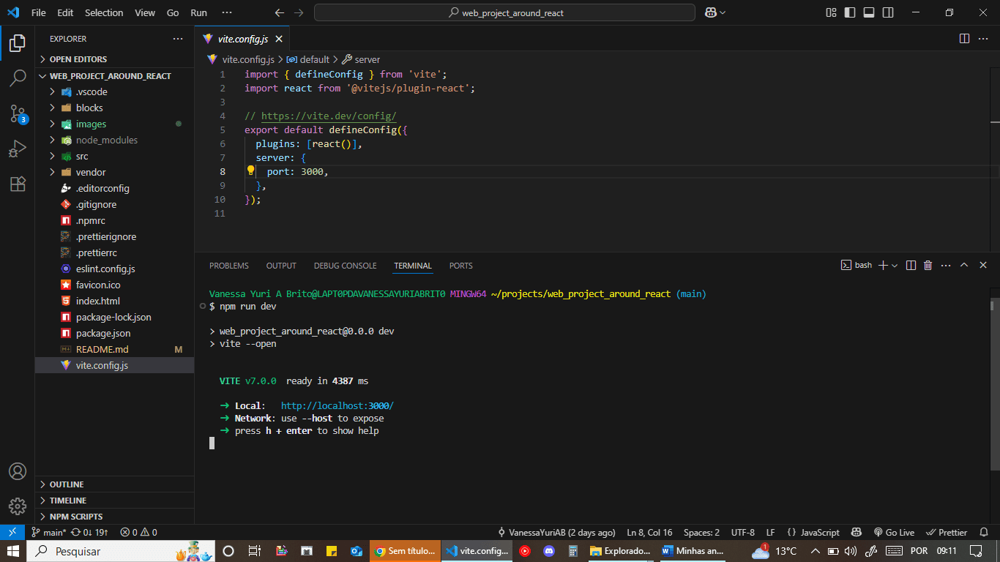

1. _Arquivo `vite.config.js` com a porta local configurada para `3000` e o plugin do React habilitado. **Obs:** a porta padrão do Vite é `5173`._
2. _Terminal exibindo o comando `npm run dev` com o servidor local acessível em `http://localhost:3000`._

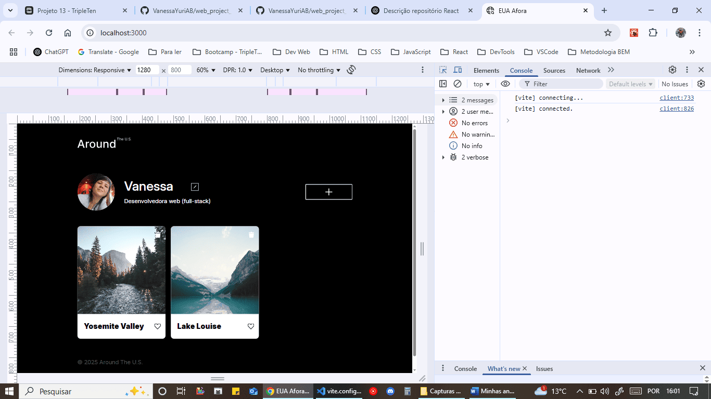

1. _Interface do projeto sendo servida com Vite no navegador._
2. _Alterações no código refletem instantaneamente na interface via hot reload._

> ### ⚛️ React (com Hook)

Biblioteca JavaScript para construção da interface usando componentes funcionais e gerenciamento de estado com Hooks. Utiliza JSX (HTML-in-JavaScript) para estruturar a interface de forma declarativa, com sintaxe semelhante ao HTML.

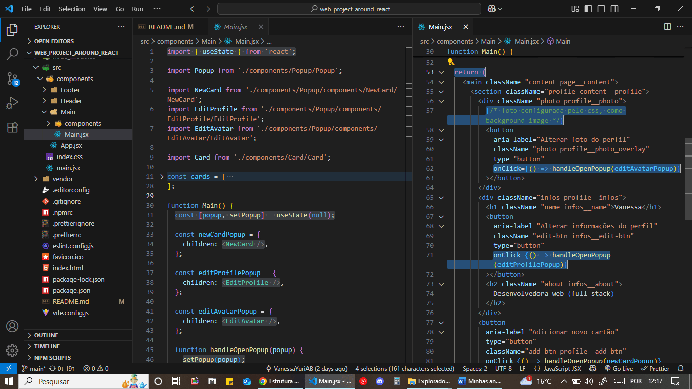

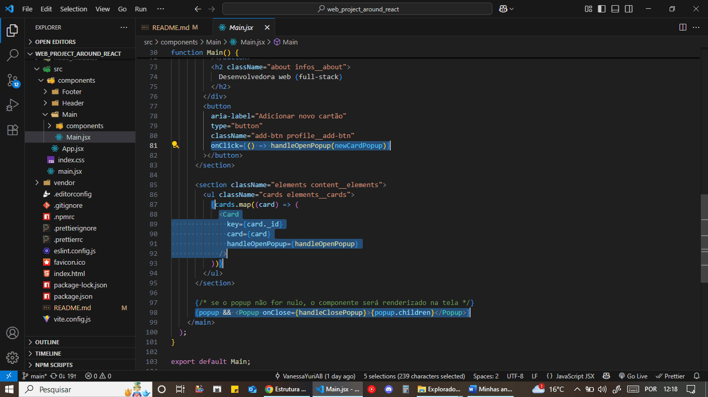

1. _Estrutura de pastas do projeto React, com componentes reutilizáveis organizados em arquivos separados._
2. _Exemplo do componente funcional `Main`, com uso do Hook `useState` para gerenciamento do estado local, no caso o controle de popups — lógica reutilizável entre diferentes componentes._
3. _JSX renderizando a interface com elementos como `<div>`, `<button>`, e uso de manipulação de eventos (`onClick`) para interações, no caso abrir e fechar popups._
4. _Renderização condicional com operadores JavaScript para mostrar ou esconder elementos dinamicamente._

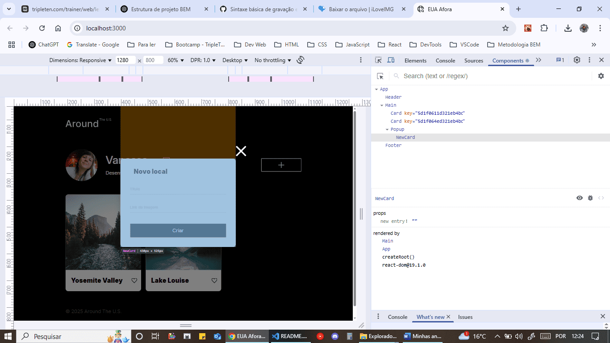

1. _Interface do projeto renderizada com React._
2. _DevTools do React abertos, exibindo os componentes ativos (`Card`, `Popup`, `NewCard`)._
3. _Mostra o estado dinâmico da aplicação e o popup de novo local funcionando._

> ### 🎨 CSS

Estilização com Flexbox, Grid Layout e Media Queries.

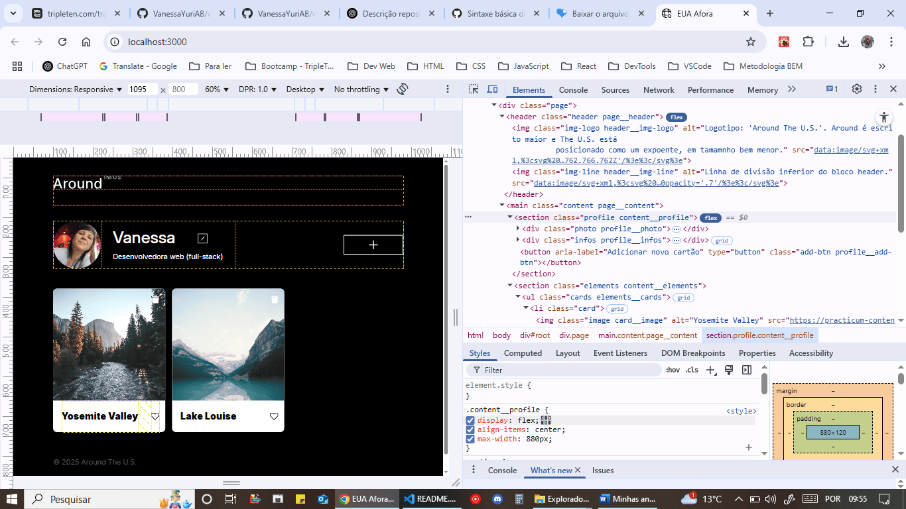

_Estilização usando `Flexbox` para organizar elementos lado a lado de forma responsiva._

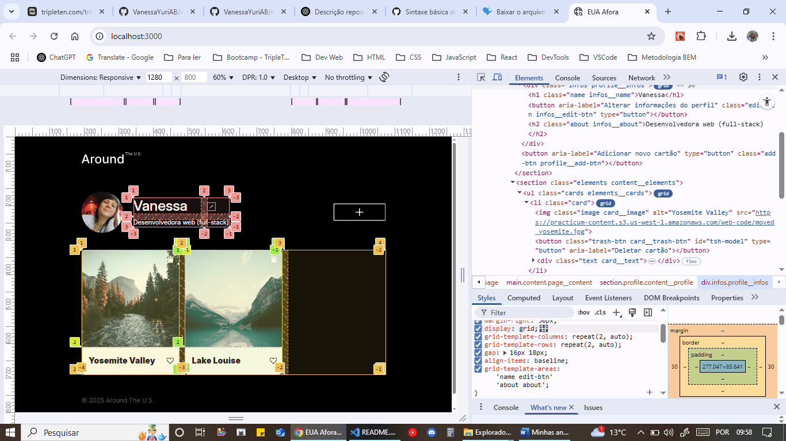

_Layout estruturado com CSS `Grid`, organizando áreas da interface em linhas e colunas._

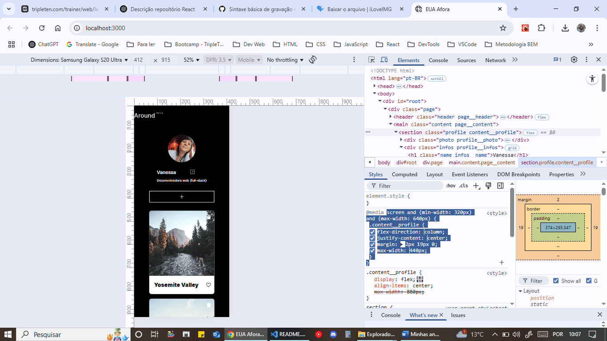
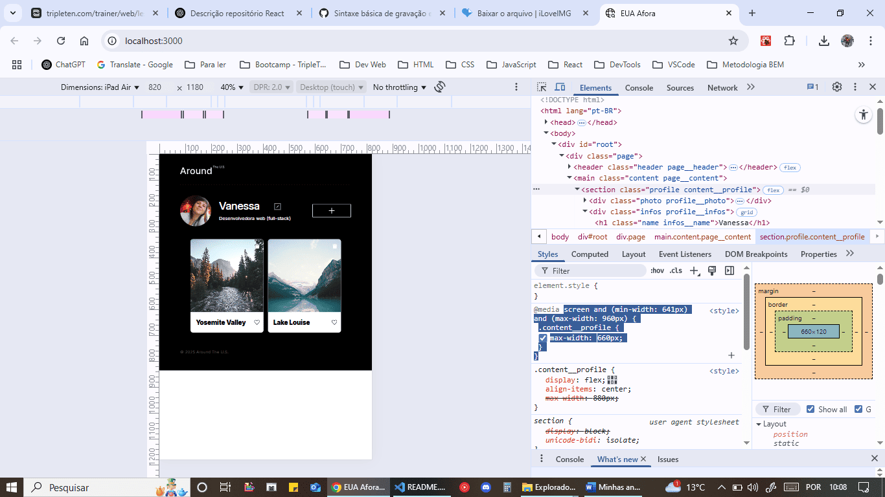

_Adaptação do layout com regras de `Media Queries` aplicadas dinamicamente via CSS, ajustando e garantindo boa visualização em diferentes tamanhos de tela._

> ### 🧱 BEM / BEM Flat

Metodologia usada para nomeação de classes CSS de forma modular, reutilizável e escalável. As classes seguem o padrão `bloco__elemento_modificador`, aplicadas diretamente no JSX e organizadas por componente.

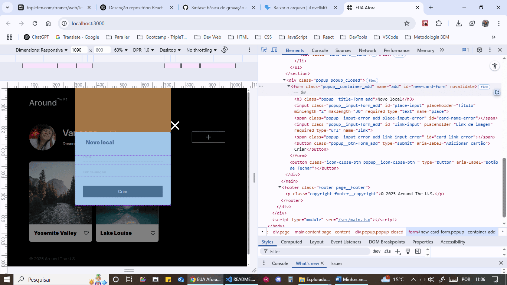

```jsx
<div className="popup popup_closed">
  <form className="popup__container_add">
    <h3 className="popup__title-form_add">Novo local</h3>
    <input className="popup__input-form_add" />
    <span className="popup__input-error_add"></span>
    <button className="popup__btn-form_add">Criar</button>
  </form>
</div>
```

1. _O bloco `popup` tem modificadores como `popup_closed`, que indicam seu estado visual._

2. _Elementos do popup como `popup__container_add`, `popup__input-form_add` e `popup__btn-form_add` seguem o padrão BEM Flat com variações específicas para o tipo de popup (neste caso, "add")._

> ### 📜 JavaScript (ES6+)

Código moderno utilizando recursos do `ECMAScript 6+`, como `template literals`, `módulos`, `arrow functions`, `map`, além de outras boas práticas da programação funcional e modular.

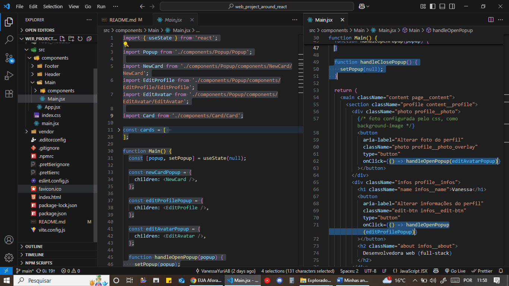

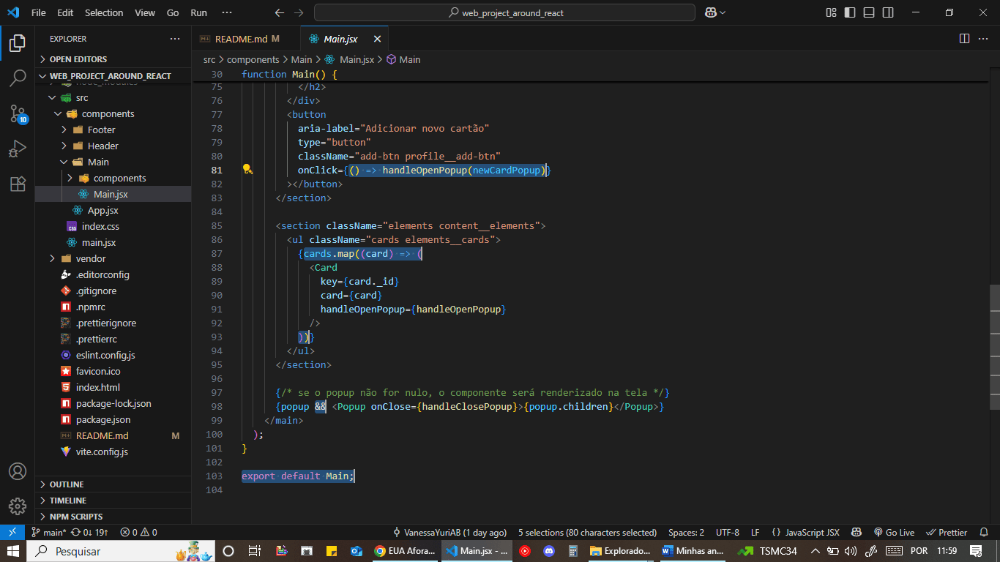

- _Modularização com `import` e `export`._
- _Declarações com `const` e `let`._
- _Objetos JavaScript — ex: `editProfilePopup` que contém propriedades._
- _`Funções` para manipulação de dados e lógica geral._
- _`Arrow functions`._
- _Método `.map()` para iterar sobre o array de cards e renderizar cada item como um componente `Card` na interface._
- _Operadores condicionais - ex: o curto-circuito com `&&` usado para renderização condicional._

# 🎥 Demonstração em vídeo do projeto:

[]()

# 🚀 Link do GitHub Pages:

> [https://vanessayuriab.github.io/web_project_around_react/](https://vanessayuriab.github.io/web_project_around_react/)

# 🚧 Melhorias:

- Implementar integração com API para salvar e carregar os cards dinamicamente.
- Adicionar validação de formulário com feedback visual.
- Implementar funcionalidade de curtidas e exclusão com atualização em tempo real.
- Criar componente de confirmação para deletar cards.
