# 🗺️ 1. Web_project_around_react: EUA Afora

```
Around The US - React: é uma versão reativa do projeto “Around the US”, com funcionalidades completas de CRUD (Create, Read, Update and Delete) para cartões, edição de perfil e avatar, validação de formulários, interações declarativas e integração com uma API real.

Projeto construído com Vite, React com Hooks, JSX, CSS responsivo com BEM Flat e arquitetura modular e reutilizável.

Este é meu primeiro projeto com Vite e React — resultado de duas sprints de aprendizado prático com foco em desenvolvimento declarativo, gerenciamento de estado e consumo de API.
```

# 🧰 2. Tecnologias e ferramentas utilizadas:

## ⚙️ Principais ferramentas de desenvolvimento:

> ### ⚛️ React + Hooks

> > → Framework e arquitetura principal do projeto. É a base da aplicação.

- 🧩 `Componentes` funcionais e reutilizáveis
- 🧬 Utiliza `JSX` (`HTML-in-JavaScript`) para estruturar a interface de forma declarativa
- 🧠 Gerenciamento de estado com `Hooks` como `useState`, `useEffect`, `useContext` e `useRef`
- 📝 Manipulação de formulários controlados
- 🔀 Renderização condicional e iterativa com `JSX`
- 🛠️ `DevTools React` para inspeção da estrutura de componentes

**No componente `App`:**

🧠 Estrutura do projeto `React` com `useState` e `useEffect`

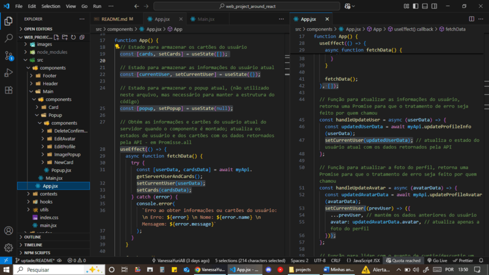

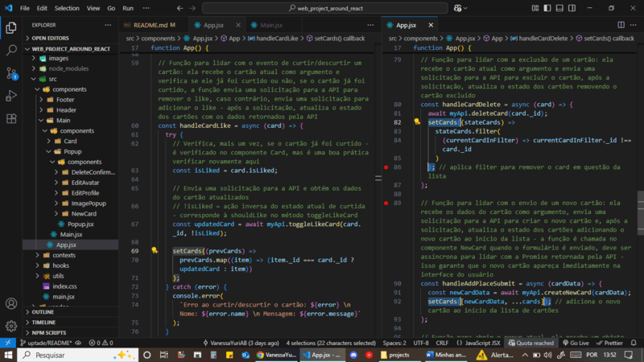

1. 📁 _Arquitetura de componentes: organização de pastas e arquivos `.jsx`._

2. 🔄 _Estado global e efeito colateral: `useState` é usado para controlar o `popup` atual, a lista de `cards` e os dados do `usuário`; `useEffect` para reações a mudanças de estado._

🧱 JSX com provedor de contexto, componentes e `props`

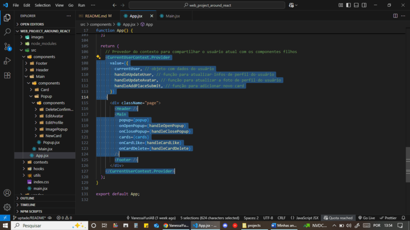

1. 🧵 _`Provider`:_

- _Encapsula `Header`, `Main` e `Footer`._
- _Compartilha `currentUser` e funções via `Context API`._
- _Permite comunicação eficiente entre componentes e centraliza o controle de estado._

2. 📬 _`Componente` e `prop`:_

- _`CurrentUserContext.Provider` e `Main` recebem `props`._
- _`Main` recebe:_
  - _`popup`: estado do popup atual._ 🔁
  - _`onOpenPopup` / `onClosePopup`: funções para abrir/fechar popups._ 🔘
  - _`cards`: lista de cards._ 🃏
  - _`onCardLike` / `onCardDelete`: funções para curtir ou excluir cards._ ❤️🗑️

**No componente `Main`:**

🧩 Separação de responsabilidades:

- 🔧 `App` orquestra a lógica
- 🎨 `Main` renderiza a interface

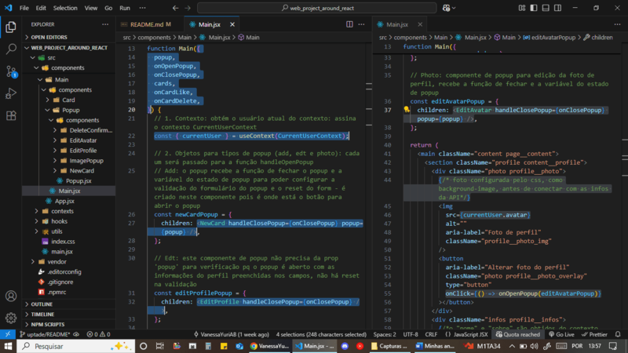

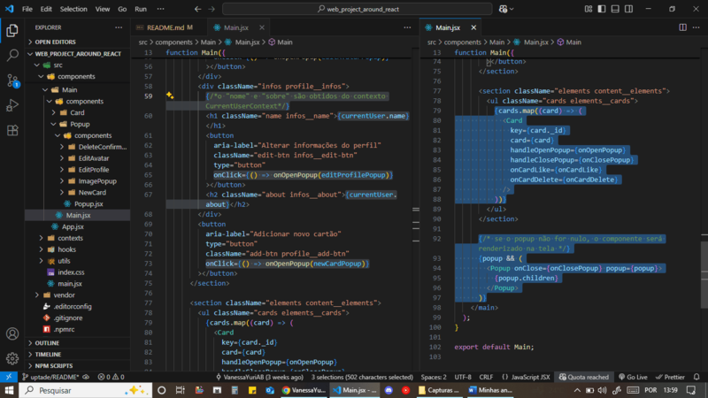

- 🧱 _Composição fluida de `componentes` e passagem de dados por `props`._

- 🎯 _Uso de `useContext` para acessar os dados do usuário, assinando o `CurrentUserContext`._

- 🧩 _Objetos `popup` organizam os diferentes formulários modais (`NewCard`, `EditProfile`, `EditAvatar`), renderizados como `children` na interface._

- 🖱️ _Eventos `onClick` disparam `handlers` para abrir `popups`._

- 🔁 _Renderização iterativa de `Card` com `map`._

- ⚙️ _Renderização condicional do `Popup`, exibido quando `popup` está definido._

**No componente `Popup`:**

🧼 `useEffect` com função de limpeza (`cleanup function`).

```js
useEffect(() => {
  const handleEscClose = (evt) => {
    const keyIsEsc = evt.code === 'Escape';
    if (popup && keyIsEsc) onClose();
  };

  document.addEventListener('keydown', handleEscClose);

  return () => {
    document.removeEventListener('keydown', handleEscClose);
  };
}, [popup, onClose]);
```

- 🧹 _Remoção de efeitos colaterais com `cleanup function` no `useEffect`, garantindo liberação de `listener` (`keydown`) ao desmontar._

**No componente `NewCard`:**

📄 Estrutura de formulário com `onSubmit`, campos controlados via `ref` e botão reativo (`Criar` / `Criando...`) controlado por `isLoading`, proveniente do hook personalizado `useFormSubmit`.

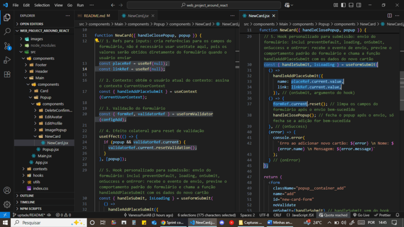

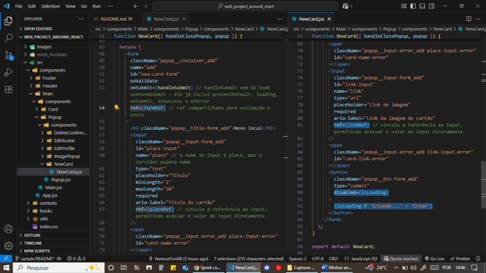

- 🔍 _`useRef` para criar referências diretas aos campos `place` e `link`, acessados no momento da submissão do formulário._

- 🛠️ _Aplicação de hooks personalizados: `useFormValidator` para configurar e resetar a validação dos campos e `useFormSubmit` para controlar o envio do formulário._

- 🧩 _A função `handleAddPlaceSubmit`, obtida via `useContext`, é utilizada no envio para enviar os dados ao contexto global, conforme demonstrado anteriormente no componente `Main`._

**Nos hooks personalizados `useFormSubmit` e `useFormValidator`:**

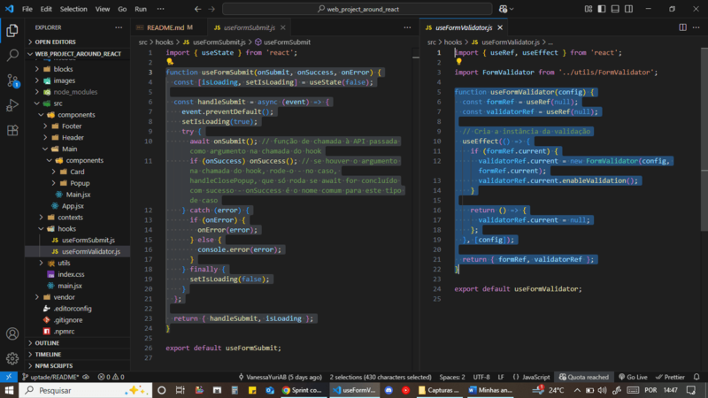

1. _📤 `useFormSubmit`:_

- _Encapsula a lógica de envio de formulários assíncronos._
- _Controla o estado de carregamento (`isLoading`) e executa funções de ciclo (`onSubmit`, `onSuccess`, `onError`)._

2. _✅ `useFormValidator`:_

- _Encapsula a lógica de validação de formulários com `inputs` controlados._
- _Cria e ativa instância de `FormValidator` associada ao elemento `<form>`, com referências ao `form` e ao validador para manipulação e reset da validação_

**No `React DevTools`:**

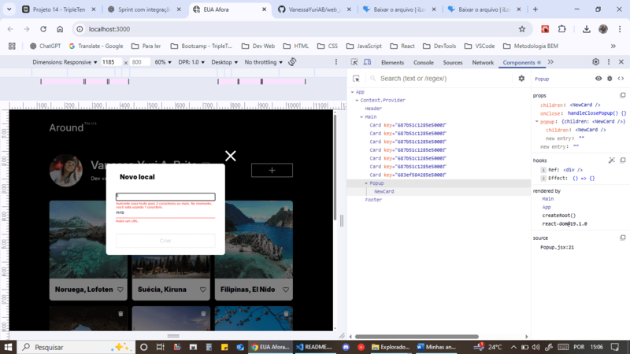

1. 🖥️ _Interface renderizada com `React`._

2. 🧭 _`React DevTools` aberto, exibindo estrutura ativa de componentes (`App`, `Context.Provider`, `Main`, `Card`, `Popup`, `NewCard` e `Footer`)._

3. 💡 _Mostra o estado dinâmico e a validação ativa no `popup` de novo local._

> ### ⚡ Vite

> > → Ferramenta responsável por empacotar e servir a aplicação React, orquestra todo o processo.

- 🛠️ Ferramenta moderna de `build` e servidor de desenvolvimento
- 🚀 Rápido e leve, com suporte nativo a `React`
- 🔄 `Hot Reload` automático


1. ⚙️ _Arquivo `vite.config.js` com a porta local configurada para `3000` e o plugin do `React` habilitado. **Obs:** a porta padrão do `Vite` é `5173`._

2. 💻 _Terminal exibindo o comando `npm run dev` com o servidor local acessível em `http://localhost:3000`._

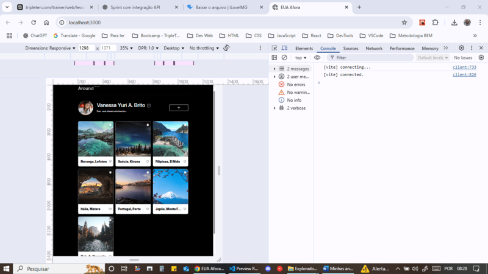

1. 🌐 _Interface do projeto sendo servida com `Vite` no navegador._

2. 🔁 _Alterações no código refletem instantaneamente na interface via `Hot Reload`._

> ### 🧪 PostCSS

> > → Atua durante o build (`npm run build`), no processamento de CSS dentro do pipeline do Vite. É integrado automaticamente pelo Vite.

- ✅ Configurado para:
  - 🌀 Adicionar prefixos automáticos para compatibilidade com navegadores antigos
  - 🧼 Minificar o CSS para produção
  - 🧩 Integrar com estilos globais ou módulos CSS usados no projeto

- 📦 Plugins utilizados:
  - 🧪 `autoprefixer`
  - 🧼 `cssnano`

## 🧹 Padronização e qualidade de código:

> ### 🎯 Prettier

> > → Ferramenta de formatação automática de código, durante o desenvolvimento, para suporte à padronização.

- ✨ Algumas regras de formatação aplicadas:
  - 📝 Aspas simples (`'`)
  - 📍 Vírgula final em objetos e arrays (`trailingComma: 'es5'`)

- ⚙️ Arquivos de configuração incluídos:
  - `.prettierrc` – define as regras de formatação
  - `.prettierignore` – exclui arquivos e pastas da formatação (ex: `node_modules`, `dist`, `build`, `vendor/normalize.css`)

- 🔗 Integração com ESLint via `eslint-plugin-prettier` e `eslint-config-prettier`:
  - 🔧 Garante que o código siga as regras de estilo automaticamente
  - ✅ Evita conflitos entre regras de lint e formatação

> ### 🧹 ESLint

> > → Ferramenta de lint e análise de qualidade que atua no código fonte durante o desenvolvimento.

- 🛡️ Configurado com suporte ao **React 19**, JSX moderno e **Flat Config** (novo formato de configuração do ESLint)

- 📦 Plugins utilizados:
  - 🧠 `eslint-plugin-react` – boas práticas e validações específicas de React
  - 🧪 `eslint-plugin-react-hooks` – garante uso correto dos hooks
  - 🔁 `eslint-plugin-react-refresh` – compatibilidade com Hot Module Replacement (Vite HMR)
  - 🎨 `eslint-plugin-prettier` – integra Prettier à análise do ESLint, evitando conflitos de regras entre os dois

- 🔧 Lint com regras personalizadas definidas no arquivo `eslint.config.js`, promovendo padronização de código, boas práticas de React e integração fluida com Prettier

- 🧼 Scripts disponíveis:

```bash
  npm run lint # Verifica erros e avisos de lint no projeto
  npm run lint:fix # Corrige automaticamente os problemas detectados
```

> ### 💻 Configurações recomendadas no VSCode

> > Para garantir que o código seja automaticamente formatado e validado durante o desenvolvimento.

⚙️ Extensões recomendadas:

- `esbenp.prettier-vscode` – formatação automática com `Prettier`

- `dbaeumer.vscode-eslint` – integração com `ESLint`

⚙️ Algumas configurações automáticas no `settings.json`:

```json
{
  "editor.formatOnSave": true,
  "[javascript]": {
    "editor.defaultFormatter": "esbenp.prettier-vscode",
    "editor.codeActionsOnSave": {
      "source.fixAll.eslint": "explicit"
    }
  },
  "[javascriptreact]": {
    "editor.defaultFormatter": "esbenp.prettier-vscode",
    "editor.codeActionsOnSave": {
      "source.fixAll.eslint": "explicit"
    }
  }
}
```

- _💡 Essas configurações permitem que o código seja:_
  - _✅ Formatado automaticamente com `Prettier` ao salvar arquivos `.js` e `.jsx`_
  - _✅ Corrigido automaticamente com `ESLint`, aplicando sugestões e prevenindo más práticas_

## 🧱 Tecnologias base:

> ### 📜 JavaScript moderno (ES6+)

> > → Linguagem utilizada no projeto.

- ✨ Recursos do `ECMAScript 6+`, como: `import/export`, arrow functions `=>`, `.map()`, `.filter()`, template strings, desestruturação de objetos/arrays, spread (`...`) e `async/await`

- 🧩 Modularização e organização funcional do código

- 🔁 Interação declarativa com a API (funções reutilizáveis em `utils/api.js`) - a lógica de consumo de dados é encapsulada em uma classe `Api`, que organiza as requisições com métodos reutilizáveis e uso de `Promise.all()` para operações paralelas

- ⚡ Encapsulamento de chamadas assíncronas paralelas com `Promise.all()`

- 📁 Centralização de constantes reutilizáveis em `utils/constants.js`

- 🧠 Hooks personalizados, como `useFormValidator` e `useFormSubmit`, para lógica isolada e reutilizável

- 🧪 Encapsulamento de classe em hook personalizado, combinando orientação a objetos com React moderno

- 🧵 Contexto global (`Context API`) com `CurrentUserContext` para compartilhamento de dados entre componentes

- 🧱 Objetos JS com propriedades JSX

- 🔧 Funções `handlers` reutilizáveis para lógica de submissão e controle de estado

- ⚖️ Renderização condicional com `&&` e operadores ternários (`? :`) no JSX

- 🛠️ Tratamento de erros com `try/catch` em funções assíncronas (ex: requisições da API)

**No componente `Main`:**

> > > 🧩 Integração entre lógica e visual: dados do contexto usados diretamente no JSX, incluindo imagem de avatar e controle dinâmico de popups via objetos com propriedades JSX.

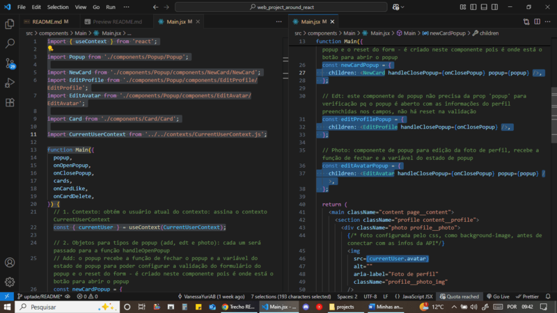

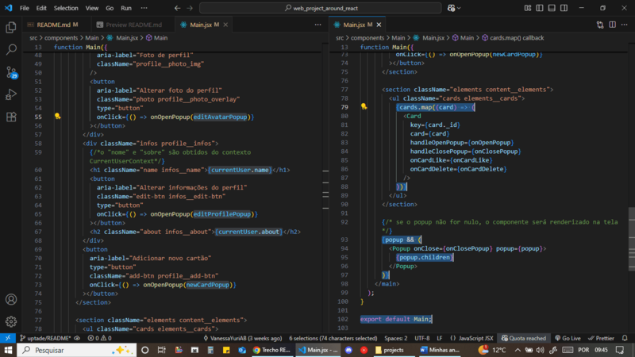

- 📦 _Modularização com `import` e `export`._

- 🔐 _Declarações com `const`._

- 🔍 _Acesso direto aos dados de `currentUser` via desestruturação do contexto._

- 🖼️ _Uso de dados contextuais diretamente no JSX (ex: avatar com `src={currentUser.avatar}`)._

- 🧱 _Criação de objetos JavaScript (ex: `editProfilePopup`) com propriedades JSX (como: `children`), permitindo controle dinâmico de componentes `Popup`._

- 🕹️ _Abertura de `popups` com passagem de objetos como argumento em `handlers` JSX, como em `onClick={() => onOpenPopup(editAvatarPopup)}`._

- 🗂️ _Renderização dinâmica de múltiplos componentes `Card` com `.map()` a partir de um array de dados._

- ⚖️ _Renderização condicional de popups com `&&`, exibindo-os somente quando a variável está definida._

**No componente `App`:**

> > > 🧪 Funções puras com efeitos previsíveis sobre o estado, facilitando testes e manutenção.

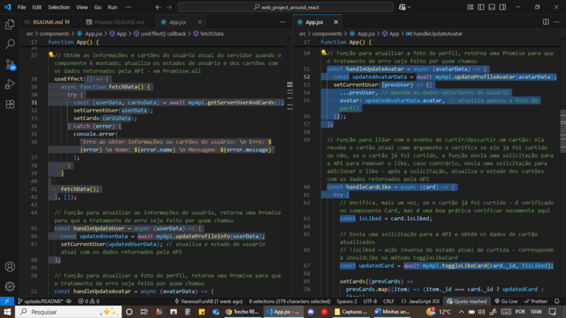

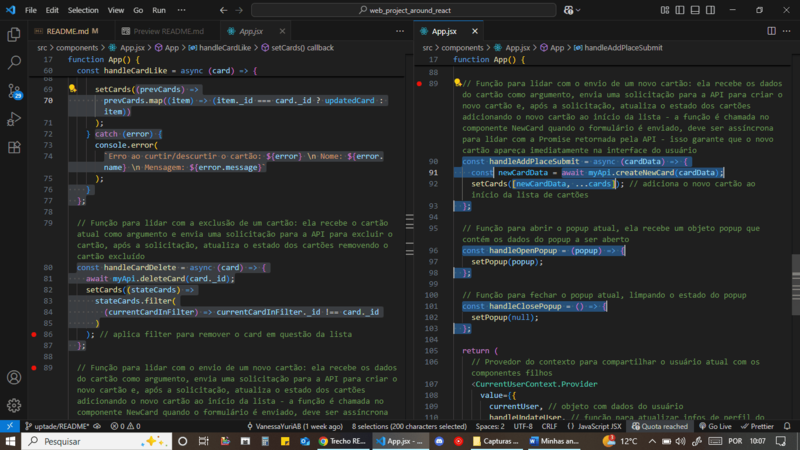

- 🎯 _Funções `arrow` para facilitar leitura e escopo léxico consistente._

- ⏳ _Funções `async/await` para lidar com requisições à API._

- 🛠️ _Tratamento de erros com `try/catch` em funções assíncronas._

- 🔍 _Desestruturação de array para acesso direto às variáveis `userData` e `cardsData`._

- 🖼️ _Aplicação direta das variáveis nos `sets` `setCurrentUser` e `setCards`._

- 🔁 _Interação com a API, utilizando a instância `myApi` e funções reutilizáveis, como: `getServerUserAndCards`, `UpdateProfileInfo`, `updateProfileAvatar`, `toggleLikeCard`, etc._

- 🧩 _Uso de template strings (`${}`) para acessar propriedades dinamicamente nas mensagens de erro._

- 🧰 _Funções `handlers` para lidar com atualizações de estado e interações do usuário._

- 🧠 _Atualização imutável do estado com `spread operator` (`...prevUser` e `...cards`), garantindo preservação das propriedades anteriores._

- ♻️ _Uso de `.map()` para atualizar o cartão após curtir/descurtir, mantendo estrutura imutável._

- 🧹 _Uso de `.filter()` no `setCards()` após exclusão de cartão, removendo-o do array de forma imutável._

**Na classe `Api`:**

```js
getServerUserAndCards() {
  return Promise.all([
    this._getServerUserInfos(),
    this._getCards()
  ]);
}
```

- 📦 _Método `getServerUserAndCards` agrupa duas requisições `GET` com `Promise.all()`, reduzindo o tempo de carregamento inicial da aplicação._

**Organização modular, constantes e lógica de validação com `FormValidator`:**

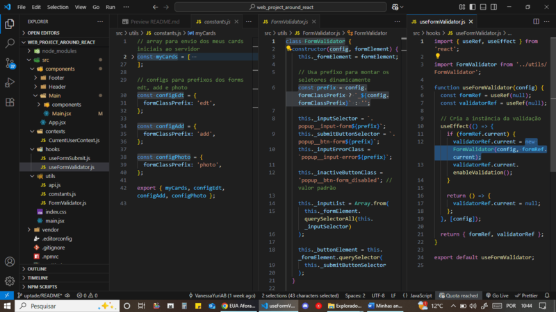

- 📦 _Constantes (`myCards`, `configs`) centralizadas no módulo `constants.js` para reutilização e configuração dinâmica dos formulários._

- 🧪 _Hook `useFormValidator` encapsula a classe `FormValidator`, instanciando-a com os `configs` para aplicar a validação._

**No componente `Popup`:**

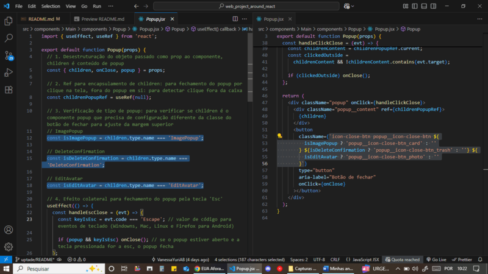

- 🧩 _Uso de `template strings` (`${}`) com `operadores ternários` (`? :`) para controle condicional de classes `CSS` no `JSX`._

📘 **Nota:** A organização do código JavaScript segue princípios de clareza, modularidade e reutilização. Cada componente possui responsabilidades específicas, enquanto funções e hooks são extraídos para pastas utilitárias quando necessário.

> ### 🎨 CSS + BEM

> > → Estilização e metodologia.

- 📐 **Layout responsivo** com `Flexbox`, `CSS Grid` e `Media Queries`

- 🧩 **Nomeação de classes** com metodologia `BEM/BEM Flat`

- 🖌️ **Estilo modular** aplicado diretamente no JSX, com organização por componente

**🗂️ CSS - Flexbox, Grid e Media Queries**

**1️⃣ Flexbox**

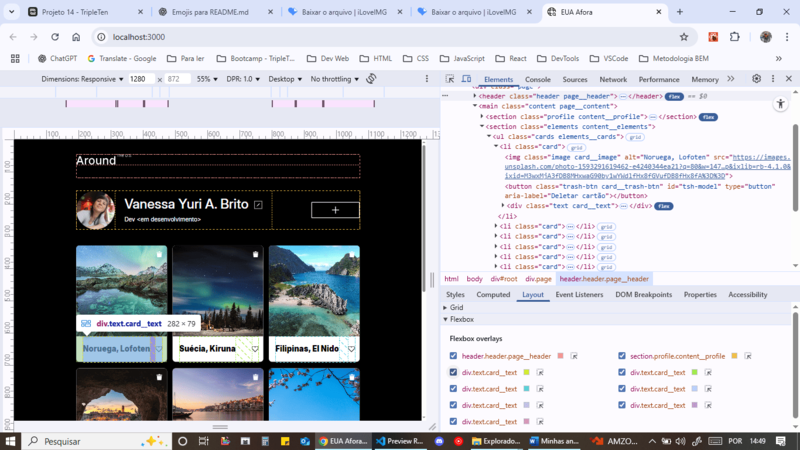

- _Estilização usando `Flexbox` para organizar elementos lado a lado de forma responsiva._

**2️⃣ Grid Layout**

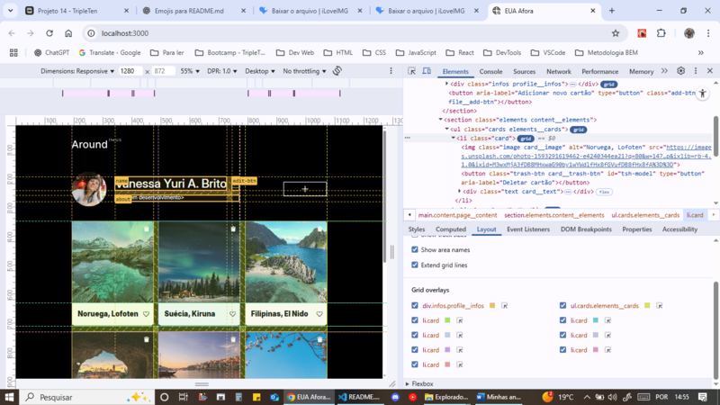

- _Layout estruturado com `CSS Grid`, organizando áreas da interface em linhas e colunas._

**3️⃣ Media Queries**

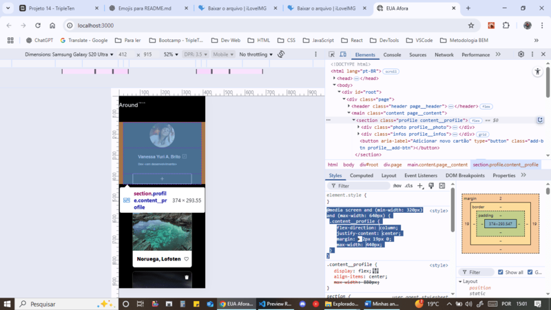
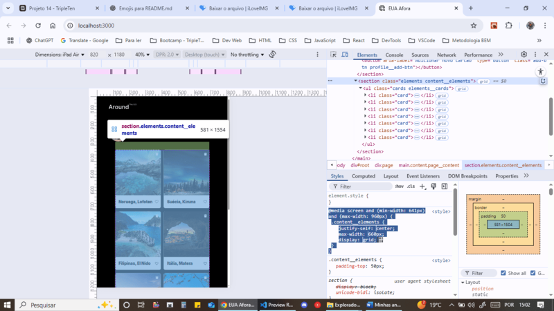

- _Adaptação do layout com `Media Queries`, aplicadas dinamicamente para garantir boa visualização em diferentes tamanhos de tela._

**🧱 Metodologia BEM / BEM Flat**

📎 As classes CSS seguem o padrão `bloco__elemento_modificador`, com adaptações específicas por tipo de popup:

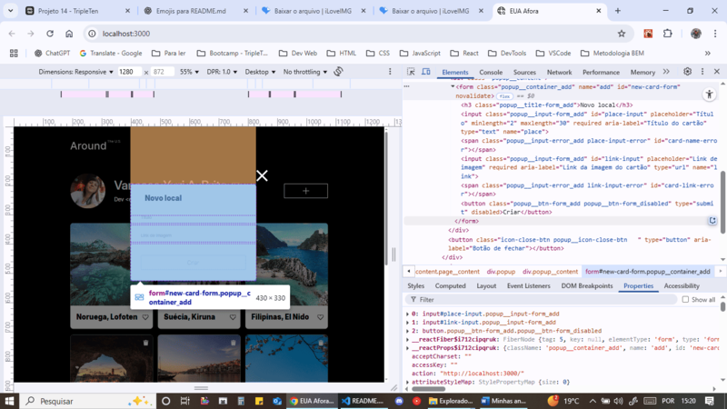

```jsx
<div className="popup">
  <div className="popup__content">
    <form className="popup__container_add">
      <h3 className="popup__title-form_add">Novo local</h3>
      <input className="popup__input-form_add" />
      <span className="popup__input-error_add"></span>
      <button className="popup__btn-form_add popup__btn-form_disabled">
        Criar
      </button>
    </form>
  </div>
</div>
```

- 🧩 _O bloco `popup` encapsula elementos como `popup__container_add` e `popup__title-form_add`, com variações específicas para o tipo de popup (neste caso, `"add"`)._

- 🛑 _O botão usa o modificador `_disabled`, indicando o estado desabilitado do botão no padrão BEM._

# ✅ 3. Funcionalidades implementadas:

> ## 🧱 Estrutura base com React e Vite

⚙️ Inicialização do projeto com `Vite` e `React`

📦 Configuração de scripts (`dev`, `build`, `lint`, `preview`) no `package.json`

🌐 Porta local personalizada para `3000` via `vite.config.js`

🖼️ Interface inicial portada de HTML para `JSX`, com estrutura semântica e modularizada

> ## 🧩 Componentização e organização

📂 Criação dos componentes principais: `App`, `Header`, `Main` e `Footer`

📦 Modularização de componentes em pastas por responsabilidade

🔁 Componentes reutilizáveis como `Popup`, `Card`, `NewCard`, `EditProfile`, `EditAvatar`, `ImagePopup`

> ## ✨ Qualidade de código e formatação automática

🛠️ Integração moderna e eficiente entre `ESLint`, `Prettier`, `Vite` e o `VSCode`, garantindo padronização e qualidade desde o desenvolvimento local.

🎨 Otimizações de CSS com `PostCSS` e plugins (`autoprefixer` e `cssnano`) aplicadas automaticamente durante o build.

🧩 Extensões e configurações recomendadas no VSCode: `prettier-vscode` para formatação e `vscode-eslint` para validação.

🔧 Configurações no `settings.json` para formatação automática ao salvar `.js/.jsx` e aplicação automática das correções de lint.

> ## 🎛️ Gerenciamento de estado e interações com Hooks

🧠 `useState`, `useEffect`, `useContext`, `useRef` para controle reativo da interface

🔘 Renderização condicional de popups com `popup && <Popup />`

🧩 Organização dos objetos de popup com `{ children }`, permitindo reutilização do layout e inserção dinâmica do conteúdo (como título e inputs) dentro do formulário

🧵 Compartilhamento de dados do usuário com `Context API` (`CurrentUserContext`)

🔁 Abordagem híbrida entre orientação a objetos (classe) e React moderno com hooks personalizados (`useFormValidator` e `useFormSubmit`)

> ## 📋 Formulários e validação

✏️ Criação de formulários controlados com `refs`

🧼 Validação customizada com `useFormValidator`, utilizando internamente a classe `FormValidator`

📤 Envio de dados com `useFormSubmit` e controle do loading com `isLoading`

🛠️ Manipuladores reutilizáveis como `handleAddPlaceSubmit`, `handleEditProfile`, `handleUpdateAvatar`

> ## 🖼️ Renderização de cartões

🗂️ Uso de `.map()` para iterar sobre o array de cards e renderizar múltiplos componentes `Card`

💾 Dados fictícios usados na primeira sprint; depois integrados com dados reais da API

📸 Visualização em tela cheia de imagens com `ImagePopup`

> ## 💻 Integração com API (CRUD)

📥 Carregamento inicial de dados do usuário e cartões (`GET`)

⚡ Carregamento otimizado com `Promise.all()`: o método `getServerUserAndCards()` encapsula as chamadas para `/users/me` e `/cards`, retornando os dados simultaneamente - aprimorando a performance e evitando múltiplos estados de espera na interface

➕ Adição de novo cartão (`POST`)

✏️ Edição de perfil (`PATCH`)

🖼️ Atualização de avatar (`PATCH`)

💖 Curtir e descurtir cartões (`PUT` / `DELETE`)

🗑️ Exclusão de cartões com popup de confirmação (`DELETE`)

🔐 Tratamento de erros com `try/catch` durante chamadas assíncronas (`async/await`)

> ## 🛡️ Acessibilidade e usabilidade

⌨️ Fechamento de popups com tecla `Esc`

🖱️ Fechamento de popups ao clicar fora do conteúdo (`overlay`)

🔁 Feedback dinâmico de botão durante carregamento (ex: "Salvando...")

🧼 Mensagens de erro em inputs inválidos

> ## 🎨 Estilização com CSS + BEM Flat

📐 Layout responsivo com `Flexbox`, `CSS Grid` e `Media Queries`

🧱 Organização semântica com `bloco__elemento_modificador`

🎨 Estilo modular com CSS vinculado aos componentes JSX

💅 Classes CSS adaptadas por estado usando template literals no JSX (`className={`...${isOpen ? 'ativo' : ''}`}`)

🧱 Encapsulamento estrutural do `<form>`s por uma `<div>` com `display: contents`, para permitir o clique externo sem impactar o layout visual (sem margens extras ou quebras na estrutura)

# 🎥 4. Demonstração:

🎞️ Vídeo demonstrando o uso da aplicação (edição de perfil, criação/exclusão de cards, etc.) em breve.

[]()

# 🚀 5. Acesse o projeto:

#### GitHub Pages:

📍 [https://vanessayuriab.github.io/web_project_around_react/](https://vanessayuriab.github.io/web_project_around_react/)

# 🚧 6. Melhorias:

- Exibir placeholder ou spinner enquanto o avatar do perfil carrega
- Configurar cursor pointer para fechamento dos popups por clique na tela
- Capturar e exibir mensagens de erro da API (ex: {"message": "Token inválido"})
- Centralizar lógica de popups com useReducer ou useContext
- Gerar índice automático com links clicáveis e adicionar vídeo de demonstrção no README.md
- Revisar e atualizar comentários
- Incluir plugin postcss-preset-env e ativar custom-media-queries para padronizar media queries com variáveis
